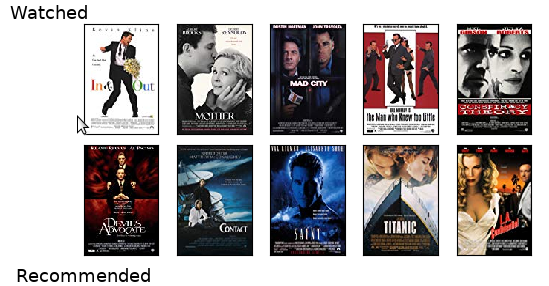

# Microsoft Recommenders Best Practice

This [MLHub](https://mlhub.ai) package provides an overview of the
[Microsoft Recommenders](https://github.com/microsoft/recommenders)
repository on github which in turn provides examples and best
practices for building recommendation systems. This MLHub package
provides a demonstration of using the repository, including a
demonstration of the smart adaptive recommender (SAR) and restricted
Boltzmann machine (RBM) algorithms for building recommendation
engines.

The hard work is done using the utilities provided in
[reco_utils](https://github.com/microsoft/recommenders/tree/master/reco_utils)
to support common tasks such as loading datasets in the format
expected by different algorithms, evaluating model outputs, and
splitting train/test data. Implementations of several state-of-the-art
algorithms are provided for self-study and customization in your own
applications.

The MovieLens data sets are used in this demonstration, containing
100,004 ratings across 9125 movies created by 671 users between
9 January 1995 and 16 October 2016. The dataset records the userId,
movieId, rating, timestamp, title, and genres. The goal is to build a
recommendation model to recommend new movies to users.

Visit the github repository for more details:
<https://github.com/microsoft/recsysbp>


## Usage

- To install mlhub (Ubuntu 18.04 LTS)

```console
$ pip3 install mlhub
```

- To install and configure the demo:

```console
$ ml install   recsysbp
$ ml configure recsysbp
```

## Demonstration

```console
$ ml demo recsysbp 
====================================
Microsoft Recommenders Best Practice
====================================

Welcome to a demo of the Microsoft open source Recommendations toolkit.
This is a Microsoft open source project though not a supported product.
Pull requests are most welcome.

This demo runs several recommender algorithms on the traditional MovieLens 
benchmark dataset which is freely available from
https://grouplens.org/datasets/movielens/.

Press Enter to continue: 

System version: 3.6.8 (default, Jan 14 2019, 11:02:34) 
[GCC 8.0.1 20180414 (experimental) [trunk revision 259383]]
Pandas version: 0.22.0

=============
SAR Algorithm
=============

SAR, the smart adaptive recommendation algorithm, is a fast algorithm for 
personalized recommendations based on user history using collaborative
filtering. It produces easily explainable and interpretable recommendations
and handles "cold item" and "semi-cold user" scenarios. 

The training data schema is:

  <User ID> <Item ID> <Time> [<Event Type>] [<Event Weight>].

Each observation is an interaction between a user and item (e.g., a movie
watched on a streaming site or an item clicked on an e-commerce website).

The MovieLens dataset records movie ratings provided by viewers. The ratings
are treated as the event weights. The smaller of the available datasets is
used, consisting of 100K users.

The dataset is being loaded. Once loaded we can review the first
few observations.

Press Enter to continue: 

==============
Sample Ratings
==============

Below we illustrate the ratings that a number of users have provided for
specific movies. Note that the Rating column will be treated as the Event
Weight and we are not displaying the Time column. From the 100,000 events
in the dataset we will be partitioning the data into training and test
subsets. The model is built from the training dataset. 

       UserId  MovieId  Rating                              MovieTitle
15109      44      294       4                        Liar Liar (1997)
11818     131      248       3              Grosse Pointe Blank (1997)
152       131      302       5                L.A. Confidential (1997)
4065      717      546       3                     Broken Arrow (1996)
61219     523      509       4                     My Left Foot (1989)
5160      806       98       4        Silence of the Lambs, The (1991)
57336     758      240       3  Beavis and Butt-head Do America (1996)
5345      940      193       3                 Right Stuff, The (1983)
56435     450       81       4             Hudsucker Proxy, The (1994)
9701      634      515       4                        Boot, Das (1981)

Press Enter to continue: 

=============
Fit the Model
=============

We will now fit the model (<1s) and apply it to the test dataset

For a random sample of users from the test dataset we list the model's
prediction of their rating of a particular movie. The predicted ratings 
are used in ranking their preferences rather than as specific ratings, hence
we see some values beyond the 1-5 range. The rankings are used to suggest
several (K=10) movies that the user has not previously seen but are likely to
be highly rated by that user.

   UserId  MovieId  Predict                            MovieTitle
0     146      690      7.1           Seven Years in Tibet (1997)
1     802       22      0.3                     Braveheart (1995)
2     226       22      1.8                     Braveheart (1995)
3     658      173      0.3            Princess Bride, The (1987)
4     457      234      9.3                           Jaws (1975)
5     328      230     13.5  Star Trek IV: The Voyage Home (1986)
6     330      186      1.1            Blues Brothers, The (1980)
7     610      202     14.0                  Groundhog Day (1993)
8     339       56     77.8                   Pulp Fiction (1994)
9     314       82      1.4                  Jurassic Park (1993)

Press Enter to continue: 

=======================
Show Random User Movies
=======================

For the first user above (originally chosen at random) we list below their
top 5 rated movies and then the movies that are recommended for them.
This user has actually rated 29 movies in total.

   UserId  MovieId  Rating                           MovieTitle
0     146     1022       5  Fast, Cheap & Out of Control (1997)
1     146      331       5                     Edge, The (1997)
2     146      336       5                   Playing God (1997)
3     146      315       5                     Apt Pupil (1998)
4     146      245       5              Devil's Own, The (1997) 

   UserId  MovieId  Predict                 MovieTitle
0     146      313      8.4             Titanic (1997)
1     146      333      8.3           Game, The (1997)
2     146      288      7.8              Scream (1996)
3     146      340      7.7       Boogie Nights (1997)
4     146      316      7.4  As Good As It Gets (1997)

We can generate a visual to show the top 5 movies as rated by the user, and
the movies recommended for the user. This requires downloading images from
Amazon (IMDB) which can take a minute or two. If you choose not to construct
the visual a previously build image will be displayed.

Shall we construct the visual? [Y|n]: n

We will display a sample image that was generated previously.
```


```console
Press Enter to continue: 

======================
Performance Evaluation
======================

We evaluate the perfomance of the model using typical recommendations model
performance criteria as provided by the Microsoft recommenders toolkit. The
following evaluation criteria are commonly used. 

Precision is the fraction of the K movies recommended that are relevant to the
user. Recall is the proportion of relevant items that are recommended. NDCG is
the Normalized Discounted Cumulative Gain which evaluates how well the 
predicted items for a user are ranked based on relevance. Finally, MAP is the
mean average precision, calcuated as the average precision for each user
normalised over all users.  MAP is generally a good discriminator between
models and is quite stable.

sar_ref with @K=10
Precision: 0.32 
Recall:    0.17
NDCG:      0.37
MAP:       0.10

Press Enter to continue: 

========================================
Restricted Boltzmann Machine Recommender
========================================

We will now demonstrate the RBM, Restricted Boltzmann Machine (RBM), algorithm.
RBM is a generative neural network model, adapted as a recommendation 
algorithm, deployed also on the traditional Movielens benchmark dataset.

System version: 3.6.8 (default, Jan 14 2019, 11:02:34) 
[GCC 8.0.1 20180414 (experimental) [trunk revision 259383]]
Pandas version: 0.22.0

Press Enter to continue: 

=============
RBM Algorithm
=============

RBM generates ratings for a user/item (i.e., movie) pair using a collaborative
filtering based approach. While matrix factorization methods learn how to
reproduce an instance of the user/item affinity matrix, the RBM learns the
underlying probability distribution. This has several advantages related to
generalizability, training stability, and fast training on GPUs.

The data schema for the training dataset is:

  <User ID> <Item ID> [<Time>] [<Event Type>] [<Event Weight>].

Each observation is an interaction between a user and item (e.g., movie
watched on a streaming site or an item clicked on an e-commerce website).

The dataset is being loaded. Once loaded we can review the first
few observations.

Press Enter to continue: 

==============
Sample Ratings
==============

Below we illustrate the ratings that a number of users have provided for
specific movies. Note that the Rating column will be treated as the Event
Weight and we are not displaying the Time column. From the 100,000 events
in the dataset we will be partitioning the data into training and test
subsets. The model is built from the training dataset. 

       UserID  MovieID  Rating                           MovieTitle
31639     882      568       5                         Speed (1994)
93016     568      735       2                  Philadelphia (1993)
78924     387       83       4        Much Ado About Nothing (1993)
13985     621     1016       4                       Con Air (1997)
47169     782      315       4                     Apt Pupil (1998)
63864      80      269       3               Full Monty, The (1997)
8960      805      679       4           Conan the Barbarian (1981)
75882     665      282       4               Time to Kill, A (1996)
60024     638      128       3                      Supercop (1992)
77312     846      426       1  Transformers: The Movie, The (1986)

Training matrix size (users, movies) is: (943, 1682)
Testing matrix size is:  (943, 1682)

We will now fit the model and apply it to the dataset

Press Enter to continue: 

The model took 19 seconds to fit and  6 seconds to rank.

Press Enter to continue to performance evalution: 

==========================
RBM Performance Evaluation
==========================

We evaluate the perfomance of the model using typical recommendations model
performance criteria as provided by the Microsoft recommenders toolkit. The
following evaluation criteria are commonly used. 

Precision is the fraction of the K movies recommended that are relevant to the
user. Recall is the proportion of relevant items that are recommended. NDCG is
the Normalized Discounted Cumulative Gain which evaluates how well the 
predicted items for a user are ranked based on relevance. Finally, MAP is the
mean average precision, calcuated as the average precision for each user
normalised over all users.  MAP is generally a good discriminator between
models and is reported to be quite stable.

rbm_ref with @K=10
Precision: 0.43 
Recall:    0.25
NDCG:      0.50
MAP:       0.17
```

# Contributing

This project welcomes contributions and suggestions.  Most
contributions require you to agree to a Contributor License Agreement
(CLA) declaring that you have the right to, and actually do, grant us
the rights to use your contribution. For details, visit
https://cla.microsoft.com.

When you submit a pull request, a CLA-bot will automatically determine
whether you need to provide a CLA and decorate the PR appropriately
(e.g., label, comment). Simply follow the instructions provided by the
bot. You will only need to do this once across all repos using our
CLA.

This project has adopted the [Microsoft Open Source Code of
Conduct](https://opensource.microsoft.com/codeofconduct/).  For more
information see the [Code of Conduct
FAQ](https://opensource.microsoft.com/codeofconduct/faq/) or contact
[opencode@microsoft.com](mailto:opencode@microsoft.com) with any
additional questions or comments.

# Legal Notices

Microsoft and any contributors grant you a license to the Microsoft
documentation and other content in this repository under the [Creative
Commons Attribution 4.0 International Public
License](https://creativecommons.org/licenses/by/4.0/legalcode), see
the [LICENSE](LICENSE) file, and grant you a license to any code in
the repository under the [MIT
License](https://opensource.org/licenses/MIT), see the
[LICENSE-CODE](LICENSE-CODE) file.

Microsoft, Windows, Microsoft Azure and/or other Microsoft products
and services referenced in the documentation may be either trademarks
or registered trademarks of Microsoft in the United States and/or
other countries.  The licenses for this project do not grant you
rights to use any Microsoft names, logos, or trademarks.  Microsoft's
general trademark guidelines can be found at
http://go.microsoft.com/fwlink/?LinkID=254653.

Privacy information can be found at
https://privacy.microsoft.com/en-us/

Microsoft and any contributors reserve all other rights, whether under
their respective copyrights, patents, or trademarks, whether by
implication, estoppel or otherwise.
